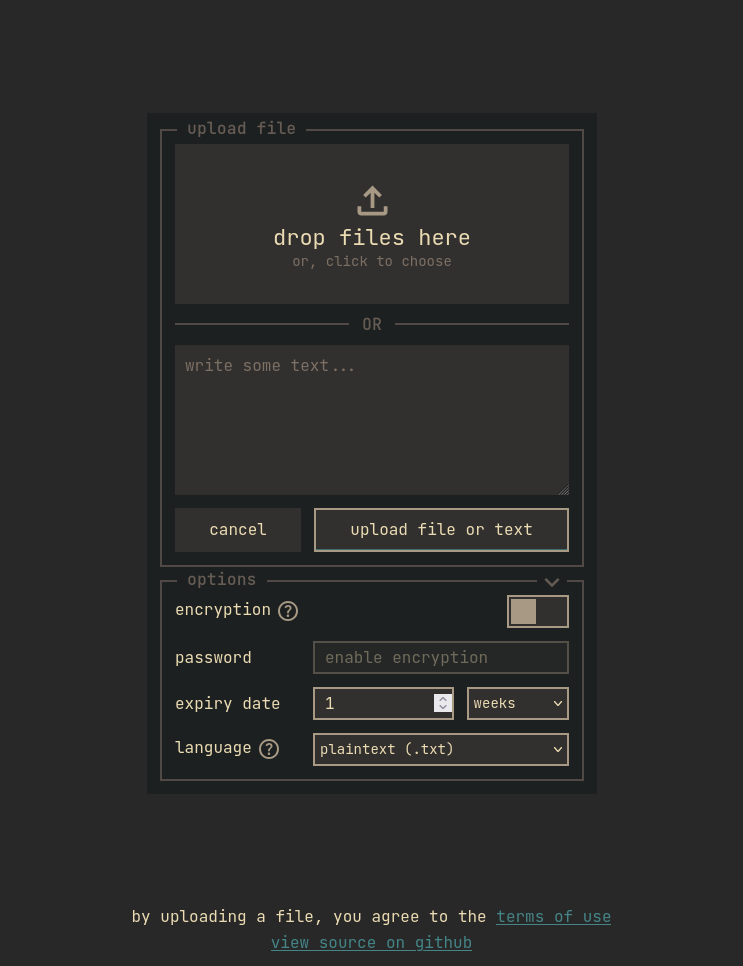
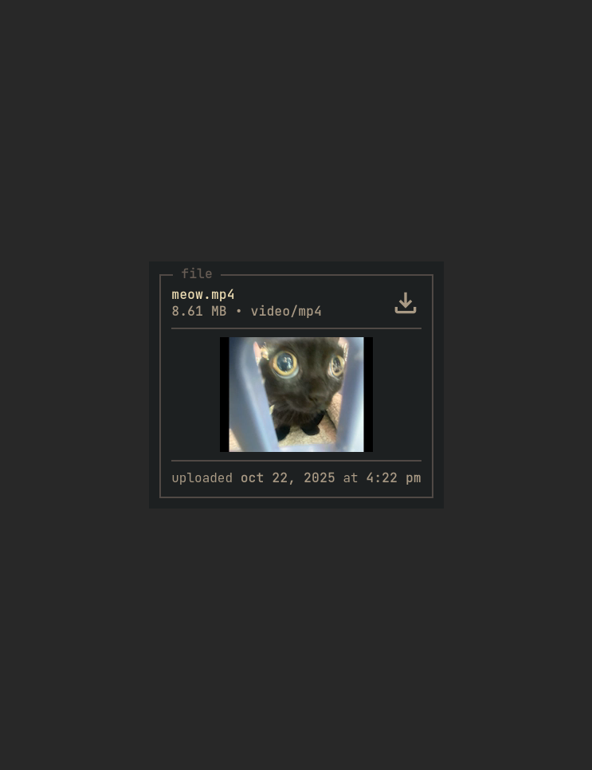
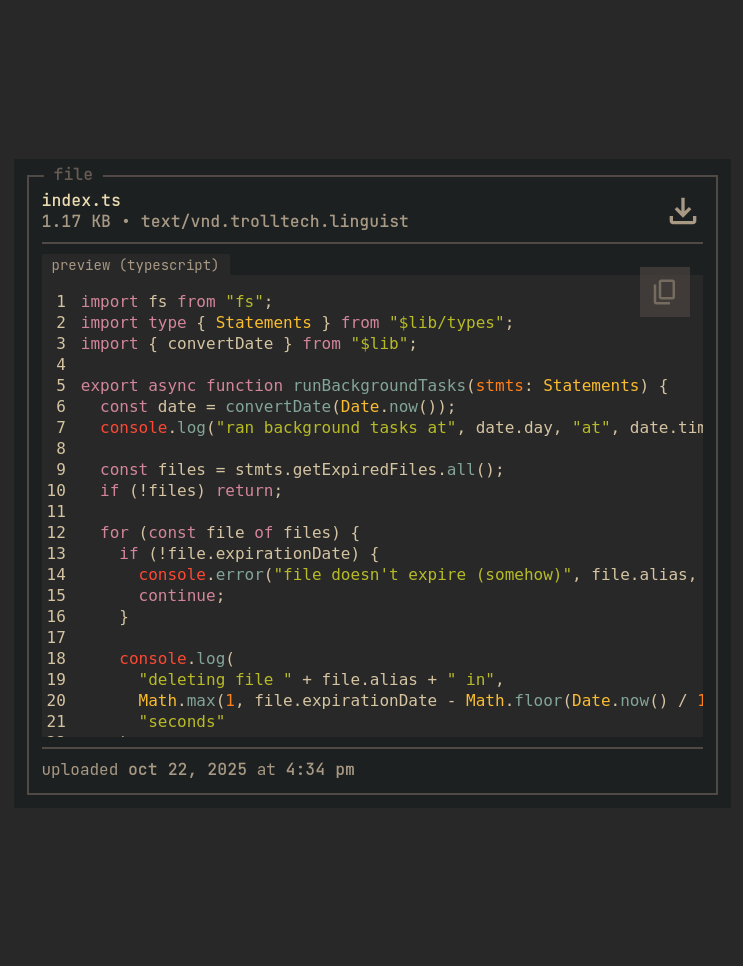

# v8p.me

a basic file uploading service built with svelte featuring client-side encryption and decryption under 1gb of memory usage

(also see [v8p.me-cli](https://github.com/vaporii/v8p.me-cli/) for encrypting and uploading files straight from the command line)

### features

- completely server safe client-side file encryption and decryption
- quick text uploading
- zip previewing
- multi-file and directory uploads
- optional file expiration dates
- sleek, utility-esque look and feel built with gruvbox
- file preview
- text preview with highlight.js highlighting (supports 50 languages, working on more)
- [opengraph](https://ogp.me/) file metadata for embedding in social medias such as discord, facebook, etc.
- low (ish) client-side and server-side memory usage

### screenshots

main page



video preview ([full video here](https://v8p.me/XPbqCf))



code syntax highlighting



### usage

if you don't want to use docker, here is a (probably not production-safe) example:

```bash
git clone https://github.com/vaporii/v8p.me
cd v8p.me
mv .env.example .env
mkdir -p data/files

npm i
npm run build
node -r dotenv/config build
```

here is the previously mentioned docker implementation:

```bash
git clone https://github.com/vaporii/v8p.me
cd v8p.me
mv .env.example .env

docker build -t v8p.me .
docker run --name v8p.me -p 3000:3000 -d v8p.me
```

or, if you use docker compose:

```bash
git clone https://github.com/vaporii/v8p.me
cd v8p.me
mv .env.example .env

docker build -t v8p.me .
docker compose up -d
```

### contributing

if you want to contribute, just make a pull request for something and i may or may not merge it

i don't really care how it's formatted, just run `go mod tidy` before making a pr and give a general description of what you changed
